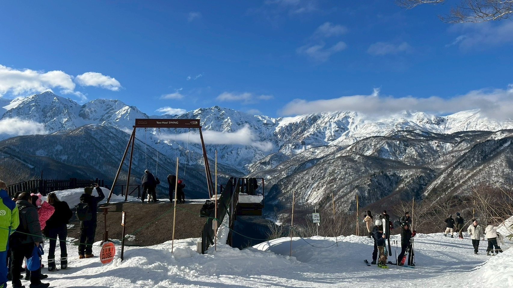

---
layout: article
title: 白馬滑雪住宿怎麼選？第一次去 Hakuba 住哪一區最好？
tag: 白馬滑雪攻略
metaLine: SnowSurfStudio Journal｜白馬滑雪・住宿攻略・Ski & Snowboard
heroImage: images/hakuba-lodging-mountain-view.jpg
heroImageAlt: 白馬雪場觀景台眺望連綿雪山
previewImage: images/hakuba-lodging-mountain-view.jpg
previewImageAlt: 白馬雪場觀景台眺望連綿雪山
leadParagraph: 第一次去日本白馬滑雪，除了選雪場之外，住宿住在哪裡也會直接影響整趟滑雪旅行的體驗。白馬的雪場分布很廣，不同住宿區域距離雪場、餐廳、交通站點都有差異，先搞懂怎麼選，行程才不會每天都花很多時間移動。
date: '2026-08-23'
dateModified: '2026-08-23'
previewDescription: 第一次去白馬滑雪不知道住哪裡？從八方、Echoland、五竜、岩岳到栂池，一次整理白馬滑雪住宿怎麼選最適合你的旅行方式。
seo:
  title: 白馬滑雪住宿怎麼選？第一次去 Hakuba 住哪一區最好？｜SnowSurfStudio
  description: 第一次去白馬滑雪，住宿要住哪一區？從八方、Echoland、五竜、神城、岩岳到栂池，一次整理白馬滑雪住宿怎麼選，幫你找到最適合自己旅行方式的住宿區域。
  keywords: 白馬滑雪住宿,白馬住宿,Hakuba 住宿,白馬八方住宿,白馬五竜住宿,白馬岩岳住宿,白馬栂池住宿,日本滑雪住宿
contentBlocks:
  - type: html
    html: |
      
      
那麼，白馬滑雪住宿到底要住哪裡？其實沒有一個區域適合所有人，最重要的是先確認你的滑雪方式。

      <h2>01｜先決定你想滑哪個雪場</h2>
      
白馬最大的特色，就是一次可以選擇很多不同的雪場。常見的滑雪區域包括：

      <ul>
        <li>八方尾根（Happo-One）</li>
        <li>白馬五竜</li>
        <li>Hakuba47</li>
        <li>白馬岩岳</li>
        <li>栂池高原</li>
        <li>白馬 Cortina</li>
      </ul>
      
如果你已經決定主要滑哪一個雪場，住宿地點就會比較好選。例如：想以八方尾根為主，可以優先找八方、Echoland 一帶的住宿；想滑五竜與 Hakuba47，可以考慮五竜、神城一帶；想滑岩岳，可以找岩岳周邊住宿；想滑栂池或 Cortina，則可以往栂池方向找住宿。

      
如果你第一次去白馬，而且還沒有決定要滑哪個雪場，也可以先從交通與整體行程來考慮。

      <h2>02｜八方、Echoland：第一次去白馬可以優先考慮</h2>
      
八方尾根是白馬最具代表性的滑雪區域之一。如果你希望住宿附近有比較多餐廳、咖啡店與生活機能，八方與 Echoland 一帶會是相對方便的選擇。

      
這一區比較適合：

      <ul>
        <li>第一次去白馬</li>
        <li>想安排多個雪場</li>
        <li>喜歡晚上出去吃飯</li>
        <li>不想每天長時間移動</li>
        <li>想感受白馬小鎮氛圍</li>
      </ul>
      
如果你的旅行除了滑雪，也希望有一些吃飯、散步、逛街的時間，這一區通常會比較容易安排。

      <h2>03｜五竜、神城：適合專注滑雪的人</h2>
      
如果你這趟旅行的重點就是：滑雪、滑雪、還是滑雪。那麼五竜與神城一帶也可以列入考慮。

      
白馬五竜與 Hakuba47 本身就是很適合安排在同一天滑行的區域。如果你希望每天早上可以比較快前往雪場，住在附近會比較方便。

      
這一區比較適合：

      <ul>
        <li>主要滑五竜</li>
        <li>想安排 Hakuba47</li>
        <li>滑雪時間比例很高</li>
        <li>不太需要晚上到處逛</li>
        <li>想減少每天的移動時間</li>
      </ul>
      <h2>04｜岩岳：滑雪之外也想拍照、看風景</h2>
      
白馬岩岳除了滑雪之外，也以山景與景觀聞名。如果你這次旅行不想每天從早滑到晚，而是希望安排一些比較悠閒的時間，岩岳周邊也可以考慮。

      
例如上午滑雪，下午休息、拍照，再到附近吃飯。對於喜歡旅行感，而不是只追求雪場里程的人來說，這種安排會比較舒服。

      <h2>05｜栂池：適合家庭與初學者考慮</h2>
      
栂池高原也是白馬很熱門的滑雪區域。如果你是第一次滑雪，或是帶家人一起旅行，可以把栂池列入住宿與雪場選擇的比較。

      
不過如果你打算同時跑很多不同雪場，就要把交通時間一起考慮進去。白馬住宿不是離雪場越近越好，而是要看你的整體行程。

      <h2>06｜白馬滑雪住宿怎麼選？直接看這張</h2>
      <table class="article-table">
        <thead><tr><th>你是誰</th><th>可以優先考慮</th></tr></thead>
        <tbody>
          <tr><td>第一次去白馬</td><td>八方／Echoland</td></tr>
          <tr><td>想吃飯、逛街</td><td>八方／Echoland</td></tr>
          <tr><td>主要滑五竜、Hakuba47</td><td>五竜／神城</td></tr>
          <tr><td>想專心滑雪</td><td>五竜／神城</td></tr>
          <tr><td>喜歡風景與拍照</td><td>岩岳</td></tr>
          <tr><td>親子旅行</td><td>栂池等區域</td></tr>
          <tr><td>想跑很多雪場</td><td>八方等交通較方便區域</td></tr>
        </tbody>
      </table>
      
這只是一個簡單的方向。真正訂房前，還是要把「你要滑哪些雪場、住宿到接駁站的距離、餐廳位置」一起放進來比較。

      <h2>07｜白馬住宿訂得越晚，選擇通常越少</h2>
      
白馬在滑雪季是熱門目的地。尤其是熱門日期、週末與年末年初，住宿選擇可能會比平日少很多。

      
如果你的滑雪日期已經確定，建議不要等到所有行程都完全確定才開始找住宿。比較實際的方式是：先確定日期 → 找住宿 → 再安排雪場與其他活動。

      
如果你已經確定要去白馬滑雪，也可以同步開始確認教練、雪票、裝備與攝影等項目。

      <h2>08｜如果你想留下「自己正在滑雪」的照片</h2>
      
滑雪旅行有一個很特別的地方：你可以拍雪山，也可以自拍。但你很難拍到自己正在高速轉彎、揚起雪花，而且整個人和雪山一起出現在畫面裡的樣子。

      
這也是滑雪跟拍和一般旅行拍照不太一樣的地方。如果你這次去白馬，希望除了滑雪之外，也留下真正屬於自己的滑雪畫面，可以把攝影安排進行程裡。

      
SnowSurfStudio 主要提供日本白馬滑雪攝影與陪伴式滑雪攝影服務，讓你不用一直拿著手機，也能留下自己在雪場裡滑行的畫面。

      <h2>結語｜白馬滑雪住宿，先從你的旅行方式開始</h2>
      
第一次安排白馬滑雪，住宿不需要追求「大家都說最好的地方」。真正適合你的住宿，應該是：你想滑哪裡 × 你想怎麼旅行 × 你願意花多少時間移動。

      
如果你主要滑五竜與 Hakuba47，可以優先考慮附近住宿。如果你第一次去白馬、希望生活機能方便，可以看看八方與 Echoland。如果你是家庭旅行，也可以比較栂池等區域。

      
先決定旅行方式，再選住宿，整趟白馬滑雪之旅通常會順很多。而當住宿、雪場與行程都安排好之後，別忘了替自己留下一些真正屬於這趟旅程的畫面。

      
<strong>SnowSurfStudio｜日本白馬滑雪攝影</strong> <a href="/index.html#plans">查看滑雪攝影服務</a>　<a href="/index.html#booking">預約你的白馬滑雪旅拍</a>

