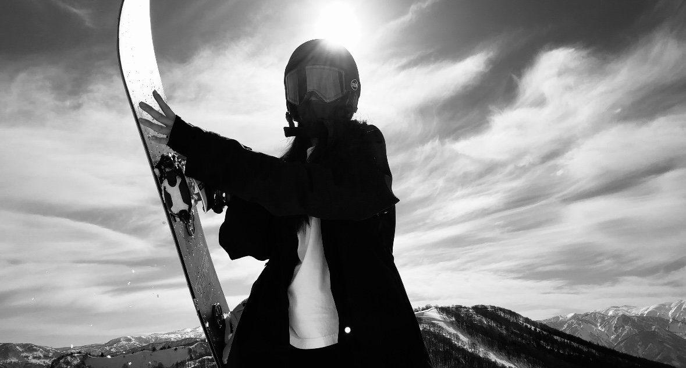

  

    <h2>GALA湯澤：新手友善、車站即雪場</h2>
    
GALA湯澤最大的特色是雪場與新幹線車站直接相連，交通非常單純，很適合安排半日或一日拍攝行程。纜車上站後視野開闊，是拍攝雪山全景與團體合照的好地點。

    
山下的滑雪學校區域坡度平緩，光線也比較均勻，很適合安排新手或親子滑雪的動作拍攝。

  

  

    
  

  

    <h2>苗場：開闊雪道，適合拍動態滑行</h2>
    
苗場雪道寬闊、坡面變化較多，是拍攝滑行線條與速度感畫面的理想地點。中午前後雪道人潮較集中時，可以選擇雪道邊緣或稍微離開主線的位置取景，畫面會更乾淨。

    
苗場也有不少樹林與緩坡地形，午後光線斜射時，樹影與雪地反光容易拍出比較有層次的畫面。

  

  

    <h2>神立：地形變化多，適合進階動作拍攝</h2>
    
神立以地形變化豐富著稱，坡度、地形起伏較適合有一定基礎的滑雪者。若計畫拍攝跳躍、抓板等進階動作，神立的天然地形能提供更多元的拍攝角度。

    
由於地形較複雜，建議拍攝前先與攝影師確認當天雪況與路線，選擇安全又上鏡的拍攝點。

  

  <h2>拍攝時段建議</h2>
  
雪場拍照的光線通常在上午與接近收纜車前最有氛圍：上午光線柔和、雪地反光較不刺眼；接近午後、太陽角度變低時，側光會讓雪地與人物的層次更明顯。中午前後陽光直射，拍攝的優點是畫面清晰、色彩準確，適合以人像與裝備細節為主的拍攝需求。

  <h2>行前提醒</h2>
  <ul>
    <li>各雪場的營業時間、纜車路線每季可能調整，出發前建議先查詢當季官方資訊</li>
    <li>雪況與天候會直接影響拍攝地點的安排，實際拍攝路線以攝影師現場評估為準</li>
    <li>不同雪場之間多有接駁或纜車連通，安排跨雪場拍攝時預留充足交通時間</li>
  </ul>

